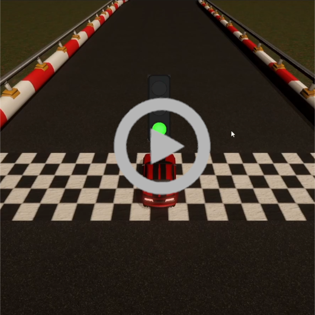

# Tenacious Drift 3D: A Drifting Game Project

Welcome to Tenacious Drift 3D, a project showcasing my growing skills in game development.

---
## Dependencies

This project relies on [Drift Game Highscores](https://github.com/AsteaFrostweb/2DDriftGameHighscores) for Highscore functionality.

## Features

- **Login and High Scores**: Connect to the game's MVC application to access high scores and track your progress.
- **Menu Screen**: Choose from available maps and cars (currently featuring one map).
- **Gameplay**: Experience drifting on challenging courses with features such as drifts, drift scores, lap tracking (including checkpoints and nodes), basic sound effects, and camera tracking/smoothing.
- **Post-Game Score Submission**: Share your achievements by submitting your score to the high scores if it surpasses your current record.
- **High Scores Web Application**: Compete with others and monitor your progress using the integrated high scores web app.

---

## Why I Created This Project

Tenacious Drift 3D has been a learning experience, improving my game development skills:

- **Game Design** Design of systems, art, map creation.
- **UI Development**: Crafting user-friendly interfaces.
- **Networking with ASP.NET Core**: Learning about ASP.net core 8 MVC.
- **Version Control**: Managing the project with Git and GitHub.

---

## Gameplay Overview

The game's main scenes are:

- **Login Scene**: Connect to high scores or play in offline mode.
- **Menu Scene**: Choose maps, cars, settings, etc.
- **Race Scene**: Race around the map trying to get a high drift-score, lap-time, or combo time.
- **Post-Game Scene**: Display and update highscores up current map.

---

## Video of Gameplay

---

## Acknowledging Areas for Improvement

Recognizing limitations:

- **Coding Practices**: Working to improve cohesion.
- **Originality**: Seeking innovation.

---

## Moving Forward

Tenacious Drift 3D is a step in my game development journey. Feedback is appreciated.

Thank you for exploring Tenacious Drift 3D.
